# Gestion Pation

## Aperçu
Gestion Pation est un projet conçu pour gérer les informations des patients de manière efficace et sécurisée.

## Fonctionnalités
- Afficher les patients
- Faire la pagination
- Chercher les patients
- Supprimer un patient
- Faire des améliorations supplémentaires

## Activité 2:
## Affichage de BD:
 

## Tester quelques opérations de gestion de patients :

## Mapping des entités

## Migration vers MySql DB

### ajout de dependence:

### ajout des propriété:

### affichage de BD

#### Affichage de table patient

### Creation de l'interface IhopitalService:

### Operation sur les entites

## Activité 3:
## Partie 1
### Lister les patients

### Patient pagination

### Recherche patient par Keyword

### Supprimer patient

## Partie 2

### Creation de page template

### Ajout patient

### Validation d'ajout patient
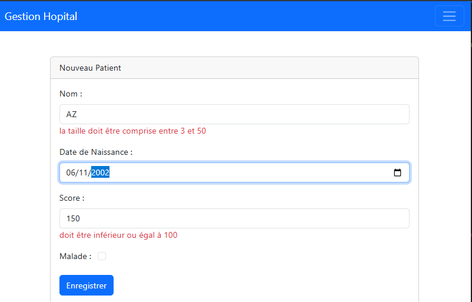

### Modifier un patient 
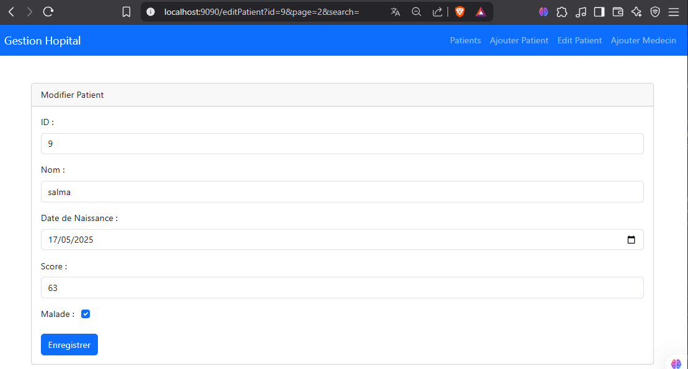

## Partie 3 
## 1. InMemomy Authentication
### Redirection en cas de non autorisation
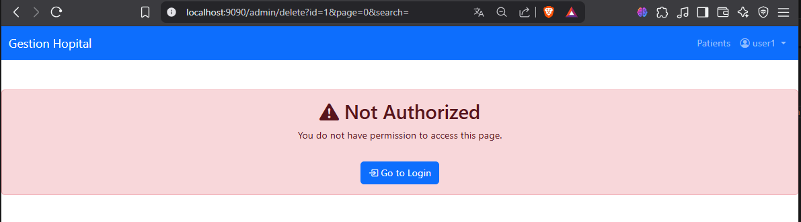

### Masquer fonctionalité d'Admin
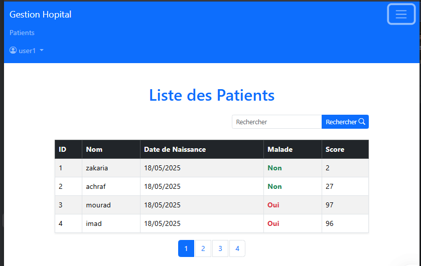

### Custum login interface
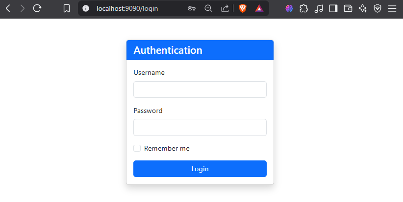

## 2. JDBC Authentication

### Table authorities
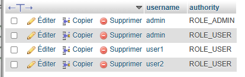

### Table users
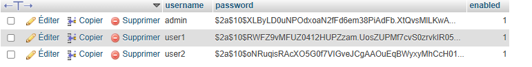

## 3. UserDetails Service

### Creation des entités User et Role
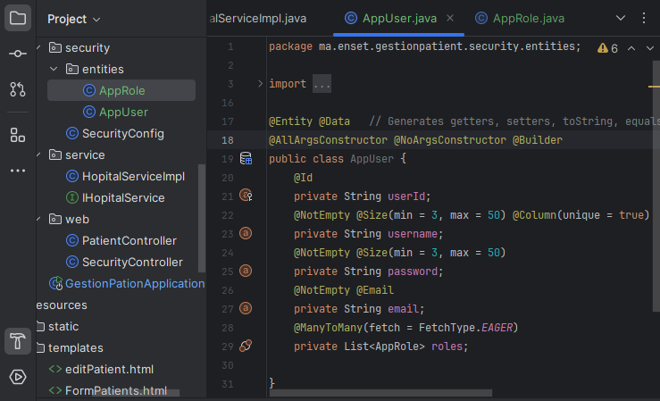

### Test UserDetailsService

#### App user table
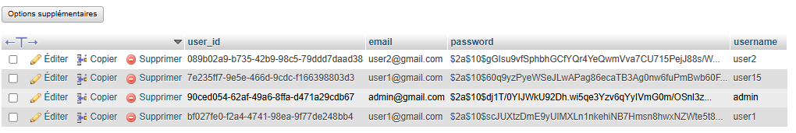

#### App user roles table
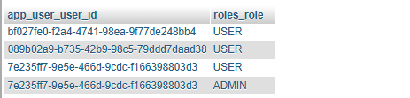

#### Login avec user 15 stocke dans App_user table
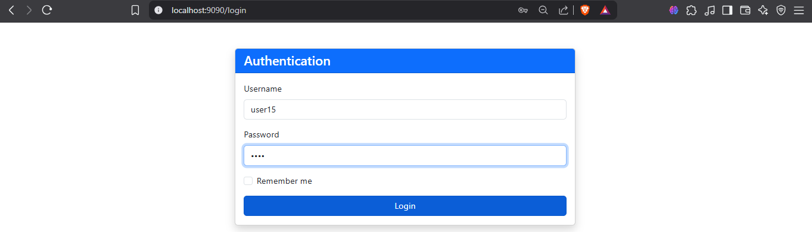

#### user 15 connecté avec succes 
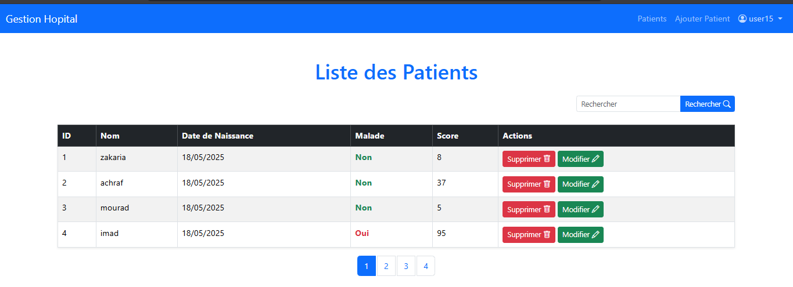