# Gestion Pation

## Aperçu
Gestion Pation est un projet conçu pour gérer les informations des patients de manière efficace et sécurisée.

## Fonctionnalités
- Afficher les patients
- Faire la pagination
- Chercher les patients
- Supprimer un patient
- Faire des améliorations supplémentaires

## Activité 2:
## Affichage de BD:
 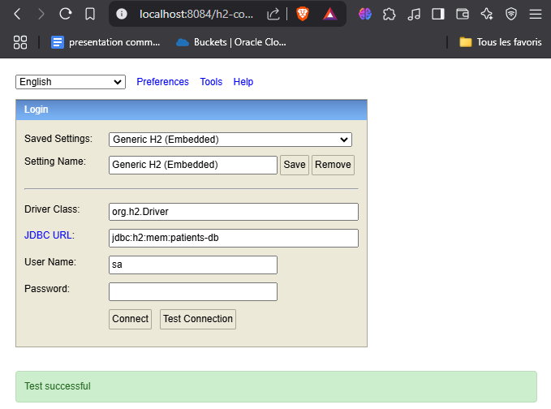

## Tester quelques opérations de gestion de patients :
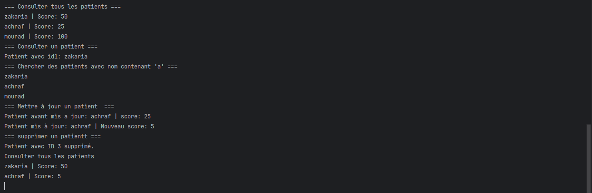

## Mapping des entités
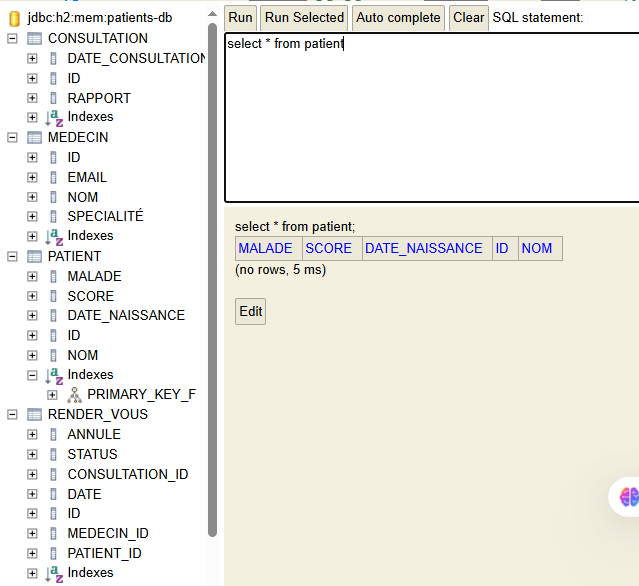

## Migration vers MySql DB

### ajout de dependence:
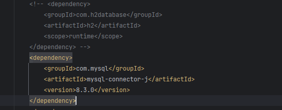

### ajout des propriété:
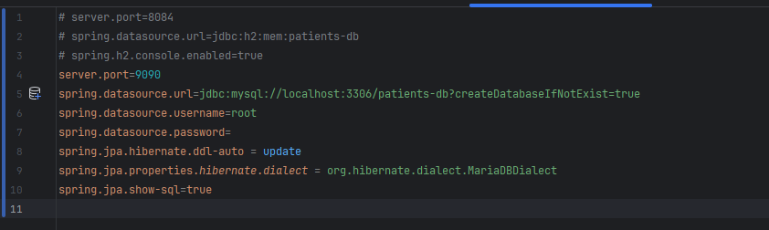

### affichage de BD
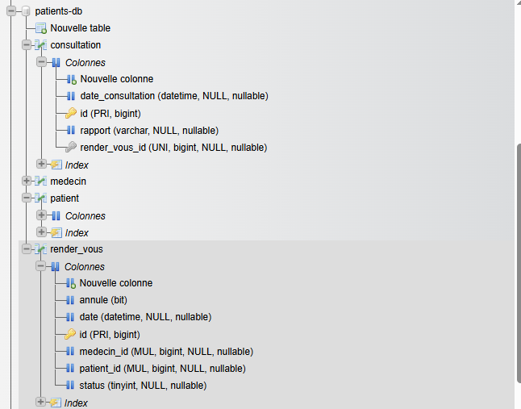
#### Affichage de table patient
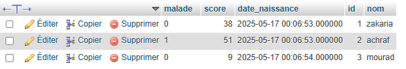

### Creation de l'interface IhopitalService:
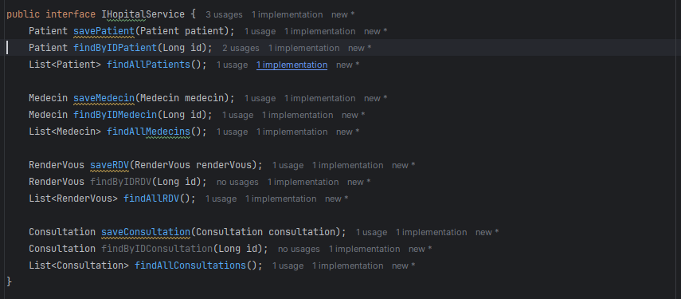
### Operation sur les entites
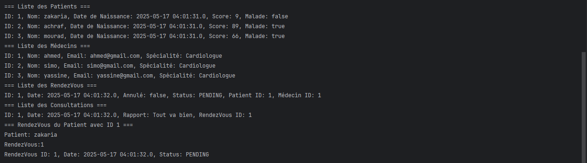

## Activité 3:
## Partie 1
### Lister les patients
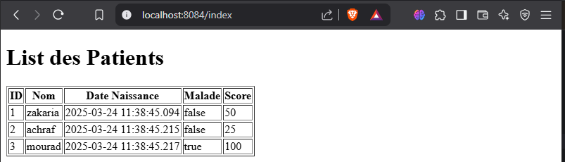

### Patient pagination
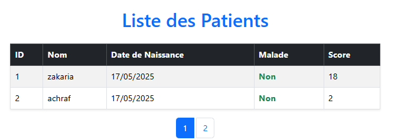

### Recherche patient par Keyword
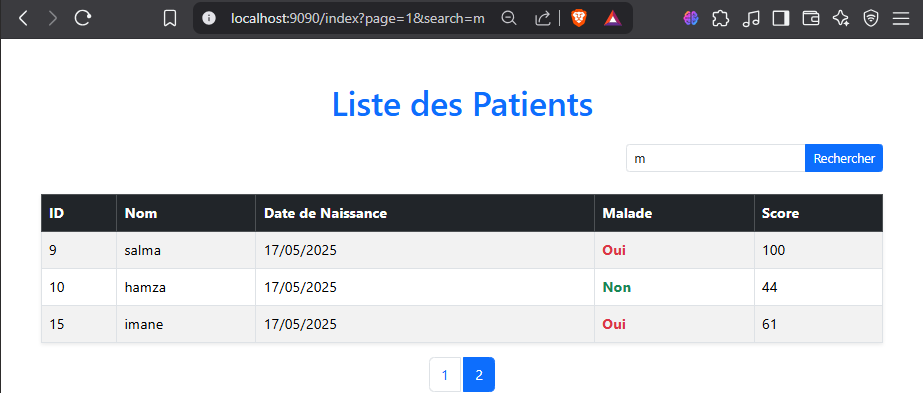

### Supprimer patient
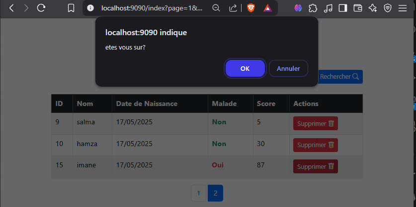

## Partie 2

### Creation de page template
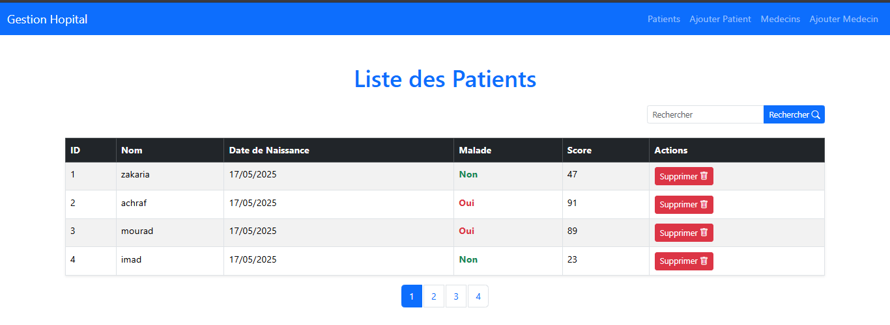

### Ajout patient
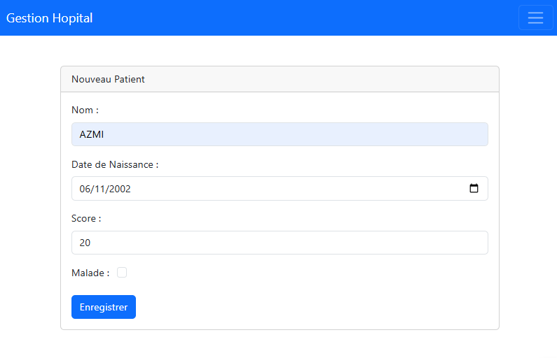